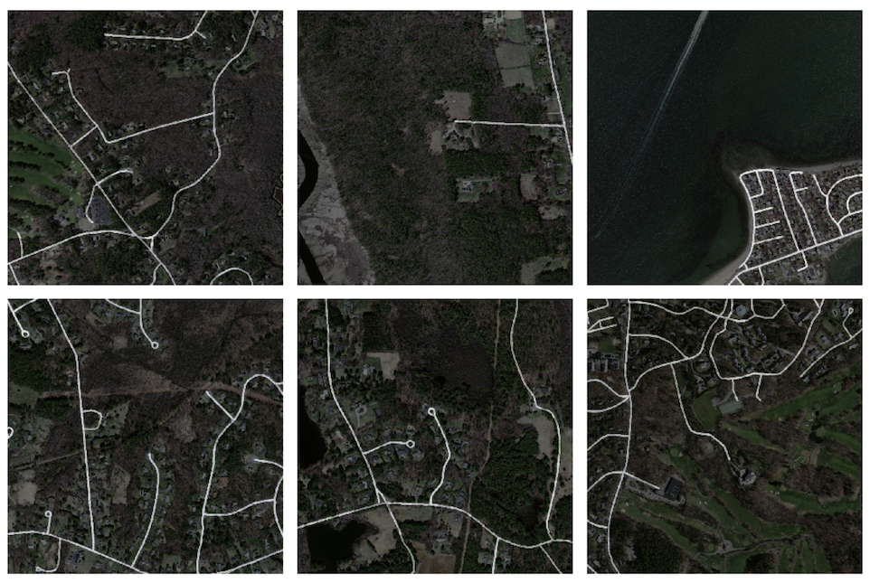

# Road and Building Extraction
**Work in progress**: Additional details will be added

This repository contains the work in progress version of code being used to extract roads and buildings from satellite imagery. The main dataset used to train the network was the Road and Building Detection [Dataset](https://www.cs.toronto.edu/~vmnih/data/) created by Volodymyr Mnih as part of his PhD thesis at the University of Toronto. Below is an example of a training image overlayed with the road network mask.

The main architecture is the [U-Net architecture](https://arxiv.org/pdf/1505.04597) that was used initially for biomedical image segmentation, but has since been successful in other tasks such as satellite imagery segmentation.
